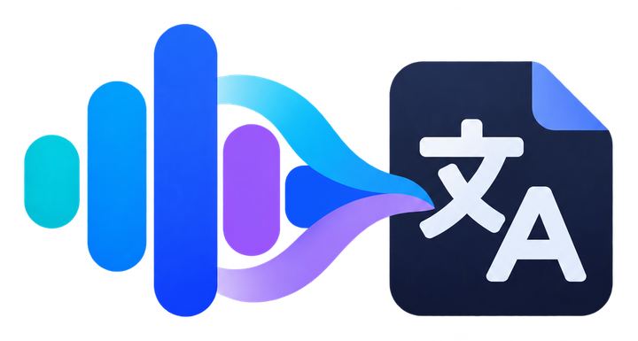
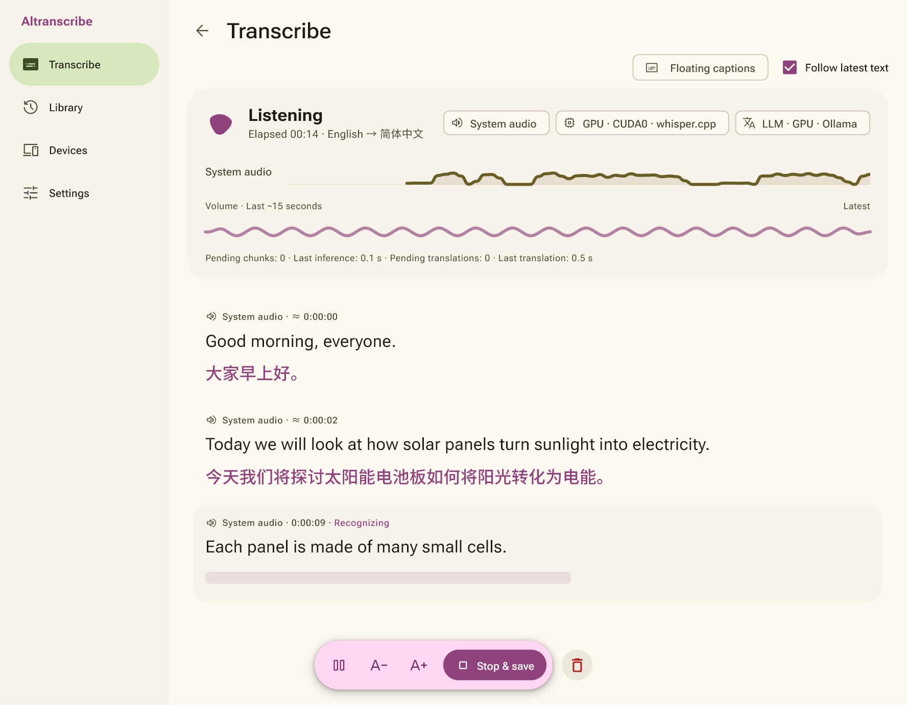
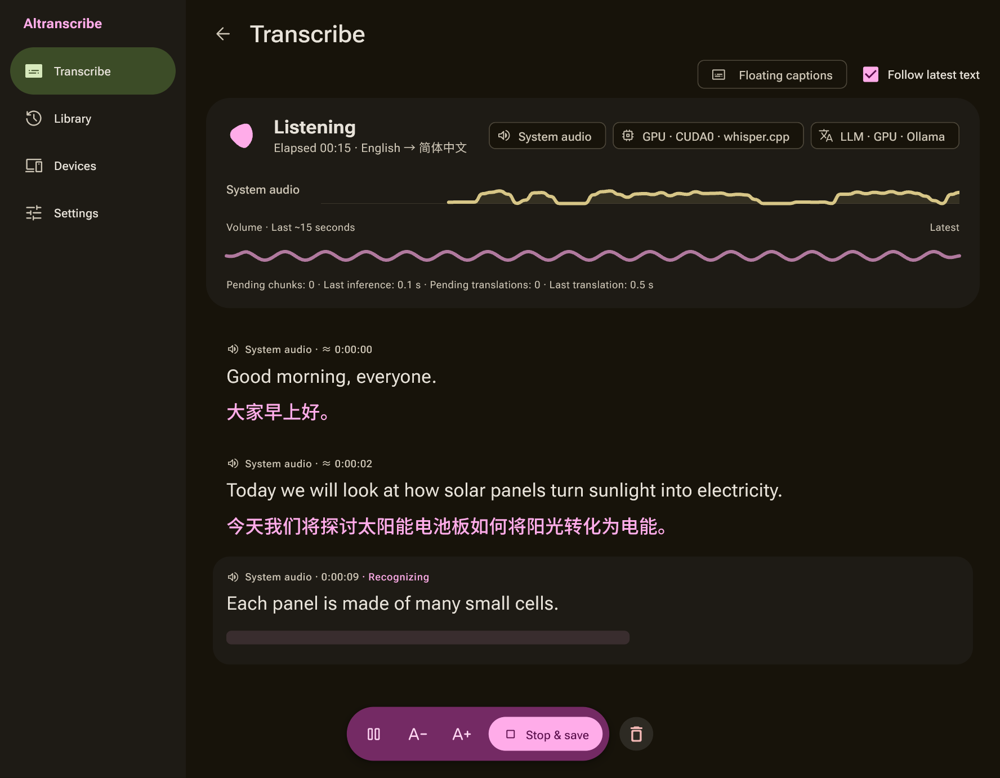
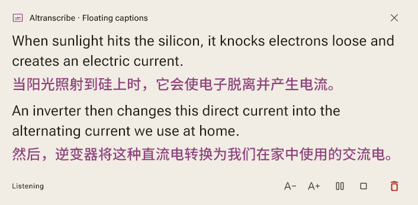
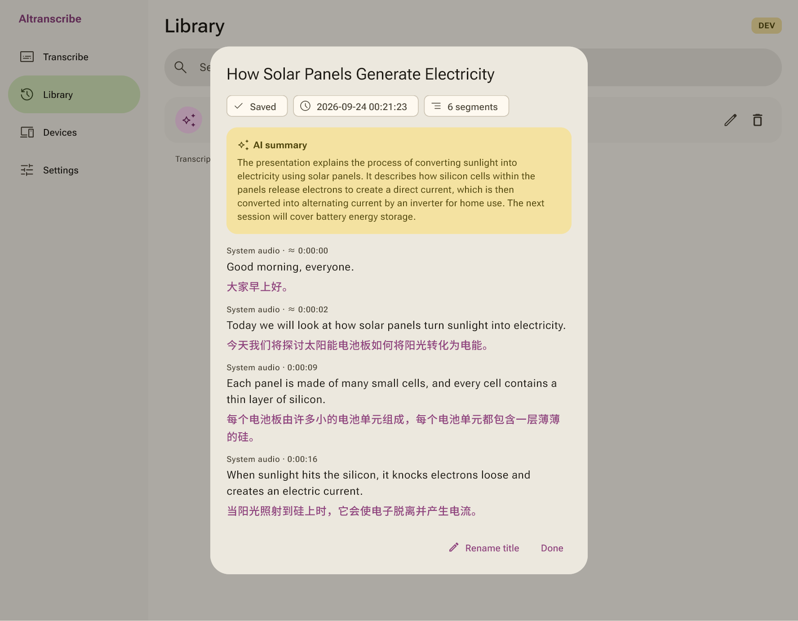

<p align="center"><picture><source media="(prefers-color-scheme: dark)" srcset="docs/images/logo-on-dark.png"></picture></p>

# Altranscribe

Real-time transcription and translation for Windows and Android. Microphone input, system audio and media files become transcripts, with floating bilingual captions.

[简体中文](README.zh-CN.md)



<details><summary>Dark theme</summary>



</details>

## Download

1. Download the Windows zip or the Android APK from [Releases](https://github.com/kiliasu/Altranscribe/releases).
2. **Windows x64**: extract the zip and run `Altranscribe.exe`. Keep the folder intact: the app needs the DLLs and `data/` beside it. If Windows reports missing DLLs, install the [Visual C++ x64 runtime](https://aka.ms/vs/17/release/vc_redist.x64.exe). File transcription also needs [FFmpeg](https://ffmpeg.org/download.html) on your PATH.
3. **Android 10 or later (ARM64)**: install the APK and allow installs from that source when asked. Audio decoding is built in. The app asks for the microphone, for notifications (its background service shows one while transcribing) and for permission to draw over other apps (floating captions) the first time each feature is used; system audio capture is confirmed every time. Audio and video files can also be sent to the app from the share menu.

The Windows app is not code-signed, so Windows may say "Windows protected your PC" on first run; choose "More info → Run anyway".

## Getting started

1. Under **Settings → Whisper models**, choose how speech is recognized: local Whisper on this computer, a Windows host on your network, or OpenAI / Gemini.
2. For translations, titles and summaries, choose a text model under **Settings → Translation & LLM**, or turn them off on the home screen.
3. Pick the microphone, system audio or both, set the languages and start. For recordings, open **Files** and add one or more audio or video files; they are processed in order.
4. **Stop & save** moves the transcript to the **Library**. The last sentences, translations and the summary finish in the background; wait for them before starting the next task.

Pausing stops new capture while earlier speech finishes processing, and **Discard recording** deletes the current transcript. Closing the caption window only hides it.

**Local models on Windows:** get `whisper-server.exe` from [whisper.cpp](https://github.com/ggml-org/whisper.cpp), enter its path in the model settings and choose CPU or GPU. The download button next to each model fetches Tiny to Large v3 Turbo and verifies the file; the [model guide](docs/en/models.md) explains adding files yourself. For translation and summaries, run Ollama or another OpenAI-compatible text service on the same computer, enter an online OpenAI-compatible service with its API key, or use OpenAI, Gemini or Anthropic directly.

Other setups: [cloud services](docs/en/cloud-providers.md) and [connecting to a Windows host](docs/en/remote-processing.md), which also lets a phone use your computer's models.

## Features

| Processing | Windows x64 | Android 10+ ARM64 |
| --- | --- | --- |
| Local Whisper (CPU / NVIDIA GPU) | Yes | No |
| Local Ollama / OpenAI-compatible text model | Yes | Through a Windows host |
| Local network sharing | Host or client | Client |
| OpenAI / Gemini (speech and text), Anthropic and online OpenAI-compatible services (text) | Yes | Yes |

- Transcribe the microphone and system audio separately or together, with live translation.
- Floating captions show the original, the translation or both, with adjustable font, size and opacity. Pause, resume or stop and save from the caption window.
- Queue WAV, MP3, M4A, FLAC, OGG, Opus, AAC, WMA, MP4, MKV, WebM and MOV files for transcripts, translations, titles and summaries. Whether a file opens depends on its actual encoding.
- Search, copy, rename and delete transcripts; export them as TXT, Markdown or an HTML page (with a player for file transcriptions) and jump to the source file. Optional name, term and word corrections keep the original results.
- English and Simplified Chinese interface, light and dark themes, amber or baseline colors.





Recognition and translation can contain errors, and timestamps marked "≈" are estimates. Speaker labels, saving the raw audio, playback and TXT / SRT / VTT export are not available; copy text from the transcript view. Caption settings are remembered, but the interface language and theme reset when the app closes.

## Privacy

Live audio is processed in memory and never saved as a recording. Transcripts stay on the device that started the task: `%LOCALAPPDATA%\Altranscribe\` on Windows, the app's private storage on Android. Deleting a transcript keeps the imported files. A diagnostic log with no transcripts or keys goes to `Documents\Altranscribe\logs` on Windows and to the app's shareable folder on Android; **Settings → Logs** opens or shares it.

With a cloud service, audio and the related text go to that provider; with remote processing, to the host you chose. Fully local processing uploads nothing. API keys and host tokens are encrypted by the operating system, so enter them again on a new computer or phone. Network sharing uses unencrypted HTTP, which is why the Android app allows cleartext traffic; use it only on networks you trust. Cloud services always use HTTPS and may charge for usage.

## Build from source

Requires Windows, Flutter 3.47.3 and Visual Studio 2022 (or its Build Tools) with "Desktop development with C++".

```powershell
./dev.ps1 -Verify
./dev.ps1
```

The first command runs the analyzer and every test, the second starts the app. `./dev.ps1 -Build -Release` builds the release version into `build/windows/x64/runner/Release/`. Android builds, the project layout and distribution notes are in [Contributing](docs/CONTRIBUTING.md).

## License

Application code: [MIT](LICENSE). Third-party components keep their own licenses, listed in the [third-party notices](docs/en/third-party.md); the Android app includes FFmpeg under LGPL 2.1+.
