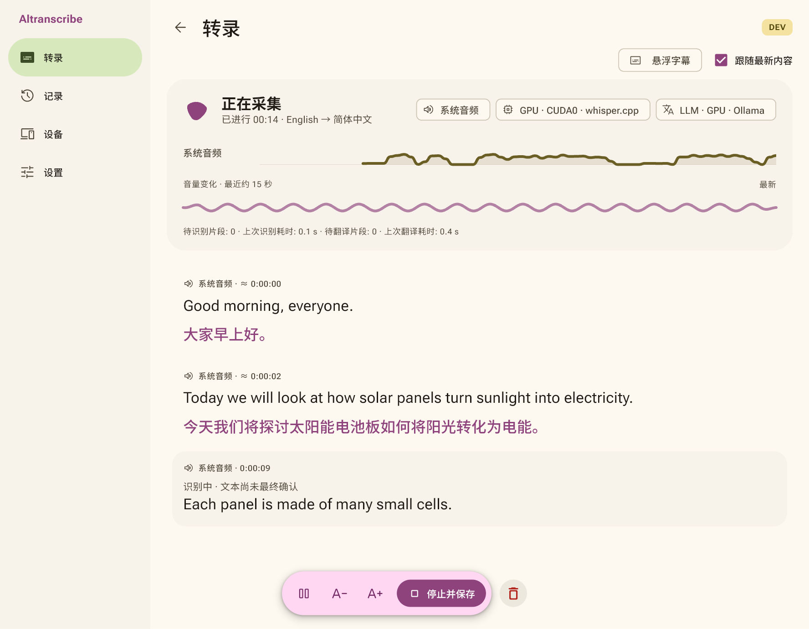
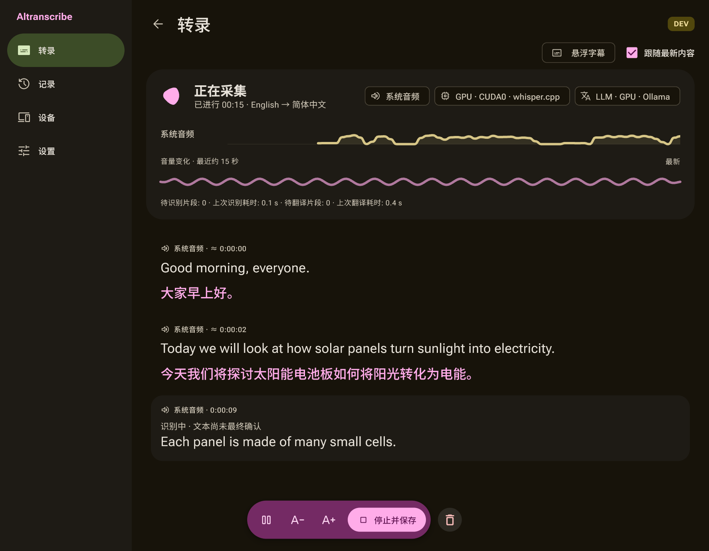
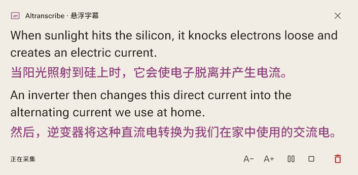
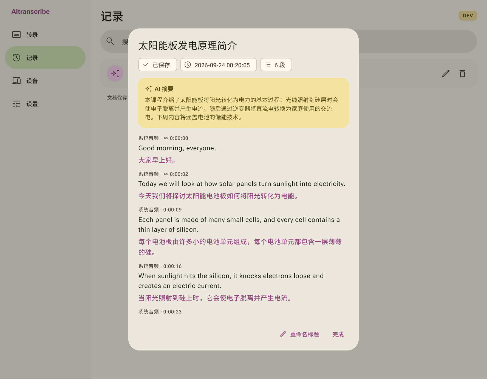

<p align="center"><picture><source media="(prefers-color-scheme: dark)" srcset="docs/images/logo-on-dark.png"></picture></p>

# Altranscribe

Windows 和 Android 上的实时转录与翻译应用：把麦克风、系统声音或音视频文件变成文稿，并显示双语悬浮字幕。

[English](README.md)



<details><summary>深色主题</summary>



</details>

## 下载使用

1. 从 [Releases](https://github.com/kiliasu/Altranscribe/releases) 下载 Windows zip 或 Android APK。
2. **Windows x64**：解压后运行 `Altranscribe.exe`。请保持文件夹完整，程序依赖同目录下的 DLL 和 `data/`。如果提示缺少 DLL，请安装 [Visual C++ x64 运行库](https://aka.ms/vs/17/release/vc_redist.x64.exe)。文件转录还需要安装 [FFmpeg](https://ffmpeg.org/download.html) 并加入 PATH。
3. **Android 10 及以上（ARM64）**：安装 APK，按提示允许安装来自该来源的应用。音频解码组件已包含在包内。首次使用相应功能时，应用会申请麦克风、通知（转录期间后台服务会显示一条通知）和「显示在其他应用上层」（悬浮字幕）权限；系统音频采集每次都需要确认。音视频文件也可以从系统分享菜单发送给应用。

程序没有代码签名，首次运行时 Windows 可能提示"已保护你的电脑"，点"更多信息 → 仍要运行"即可。

## 开始使用

1. 在「设置 → 模型选择」中选择识别方式：本机 Whisper、局域网里的 Windows 主机，或 OpenAI / Gemini。
2. 如需翻译、标题和摘要，在「设置 → 翻译选择」配置文字模型；暂不需要时可以在首页关闭。
3. 选择麦克风、系统音频或两者，设置源语言和目标语言后开始。转录音视频文件时切换到文件入口，可以一次选择多个，按队列处理。
4. 点击「停止并保存」后，文稿进入「记录」。尾句、译文和摘要会在后台补齐，完成后才能开始下一次任务。

暂停会停止采集新音频，已收到的片段继续处理；「直接遗弃」会删除当前文稿。关闭悬浮字幕只隐藏窗口，不会停止转录。

**Windows 本地模型**：从 [whisper.cpp](https://github.com/ggml-org/whisper.cpp) 获取 `whisper-server.exe`，在模型设置中填写路径并选择 CPU 或 GPU。点击模型旁的下载按钮即可下载 Tiny 到 Large v3 Turbo 并自动校验；手动放入模型的方法见 [模型说明](docs/zh-CN/models.md)。本地翻译和摘要需要在本机运行 Ollama 或其他 OpenAI 兼容的文字服务。

其他用法见 [云端服务](docs/zh-CN/cloud-providers.md) 和 [连接 Windows 主机](docs/zh-CN/remote-processing.md)，后者也能让手机使用电脑上的模型。

## 功能

| 处理方式 | Windows x64 | Android 10+ ARM64 |
| --- | --- | --- |
| 本地 Whisper（CPU / NVIDIA GPU） | 支持 | 不支持 |
| 本地 Ollama / OpenAI 兼容文字服务 | 支持 | 通过 Windows 主机使用 |
| 局域网共享 | 可作为主机或客户端 | 作为客户端 |
| OpenAI / Gemini 云端服务 | 支持 | 支持 |

- 麦克风与系统音频可以分别或同时转录，并实时翻译。
- 悬浮字幕可以显示原文、译文或双语，字体、字号和透明度可调；在字幕窗口里就能暂停、继续或停止保存。
- 批量处理 WAV、MP3、M4A、FLAC、OGG、Opus、AAC、WMA、MP4、MKV、WebM、MOV 文件，生成文稿、译文、标题和摘要；能否读取取决于文件的实际编码。
- 文稿支持搜索、复制、重命名和删除。可选的人名、术语和词汇修正会保留原始结果。
- 简体中文 / English 界面，明暗主题，琥珀或基线配色。





识别和翻译可能出错，带「≈」的时间码是估算值。目前没有讲者区分、原始录音保存、音频回听和 TXT / SRT / VTT 导出，文字可以从文稿界面复制。字幕设置会保存，主界面的语言和主题只在本次运行内有效。

## 隐私

实时音频只在内存中处理，不保存录音。文稿保存在发起任务的设备上：Windows 在 `%LOCALAPPDATA%\Altranscribe\`，Android 在应用私有目录。删除文稿不会删除导入的音视频文件。

使用云端服务时，音频和相关文字会发送给对应的提供商；使用远程主机时，发送给所选主机。全本地处理不上传任何内容。API Key 和主机令牌由操作系统加密保存，换电脑或手机后需要重新填写。局域网共享使用未加密的 HTTP（Android 版因此允许明文流量），只应在可信网络中使用。云端服务始终使用 HTTPS，并可能产生费用。

## 从源码构建

需要 Windows、Flutter 3.47.3，以及安装了「使用 C++ 的桌面开发」的 Visual Studio 2022（或 Build Tools 2022）。

```powershell
./dev.ps1 -Verify
./dev.ps1
```

第一条运行静态分析和全部测试，第二条启动应用。`./dev.ps1 -Build -Release` 构建正式版，输出在 `build/windows/x64/runner/Release/`。Android 构建、代码结构和分发要求见 [开发说明（英文）](docs/CONTRIBUTING.md)。

## 许可证

应用代码采用 [MIT](LICENSE) 许可证。第三方组件遵循各自的许可证，见 [第三方组件与许可](docs/zh-CN/third-party.md)；Android 版包含 LGPL 2.1+ 的 FFmpeg。
